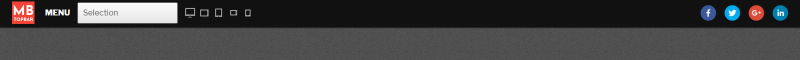
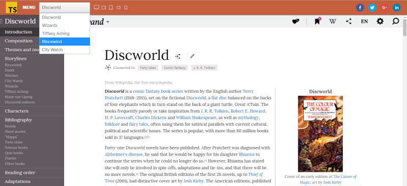

# MB Topbar - Wordpress plugin

This plugin adds demo bar on top of the page. It is suitable for web designers and web developers. If you are theme designer or developer and if you would like to showcase your designs this plugin could help.

You have the option to change your **logo** and for each *selection item* you can choose **background color** of the demo bar, **selection name** for menu and **slug** for address bar. 

**Wordpress Api** is used to send information from backend.

Built with: **Wordpress**, **React**, **Redux**

