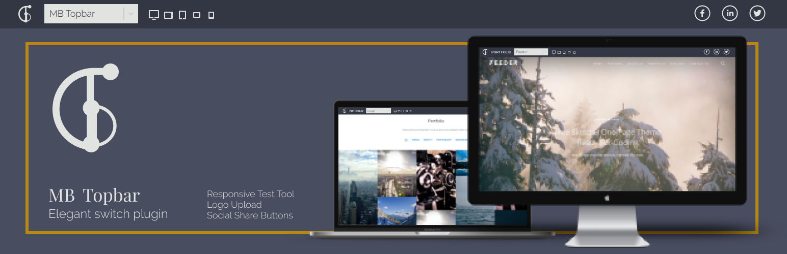

  

# MB Topbar - Elegant switch plugin

This plugin adds demo bar on top of the page. It is suitable for web designers and web developers. If you are theme designer or developer and if you would like to showcase your designs this plugin could help.

+ **Responsive Test Tool.** Change website width on the fly., Visible only on desktop.
+ **Social Share Button.** Share to Facebook, Twitter and Linkedin.
+ **Logo Upload.** Change the logo.
+ **Background Color.** Choose background color of the showcase item topbar.
+ **Showcase Name.** Select item name.
+ **Slug.** Slug for the address bar.

  

**Wordpress Api** is used to send information from backend.

  

Built with: **Wordpress**, **React**
